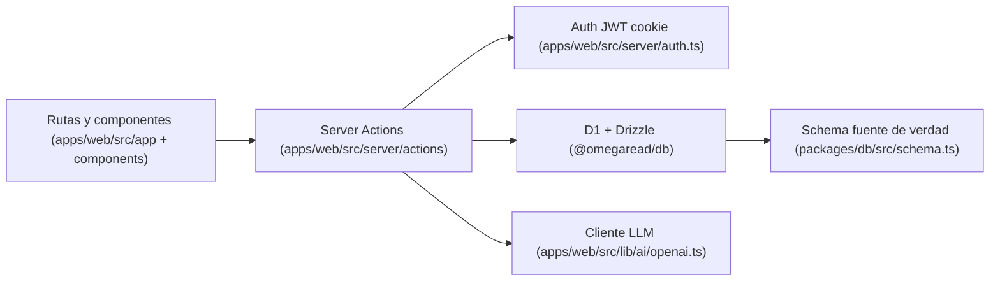

# AGENTS.md

Guia operativa para agentes que trabajan en este repositorio.

Estado de esta guia: 23 de febrero de 2026.

## 1) Objetivo

Reducir tiempo de onboarding y evitar cambios ciegos.

Este archivo te dice:

- que contiene el repo
- donde tocar cada tipo de tarea
- que invariantes no debes romper
- que validar antes de cerrar una entrega

## 2) Lectura minima antes de tocar codigo

Lee en este orden:

1. `README.md`
2. `apps/web/src/app/jugar/lectura/page.tsx`
3. `apps/web/src/server/actions/story-actions.ts`
4. `apps/web/src/server/actions/session-actions.ts`
5. `packages/db/src/schema.ts`
6. `tests/` (suites relacionadas a tu cambio)

Si tu tarea es de dashboard, añade:

- `apps/web/src/app/padre/dashboard/page.tsx`
- `apps/web/src/server/actions/dashboard-actions.ts`
- `apps/web/src/components/dashboard/*`

## 3) Mapa rapido del sistema



## 4) Donde tocar segun tarea

| Tipo de tarea | Archivos primarios |
|---|---|
| Flujo de lectura end to end | `apps/web/src/app/jugar/lectura/page.tsx`, `apps/web/src/components/lectura/*`, `apps/web/src/server/actions/story-actions.ts` |
| Intereses/contexto del nino | `apps/web/src/components/perfil/*`, `apps/web/src/server/actions/profile-actions.ts`, `apps/web/src/server/actions/lectura-flow-actions.ts` |
| Dashboard padres | `apps/web/src/app/padre/dashboard/page.tsx`, `apps/web/src/components/dashboard/*`, `apps/web/src/server/actions/dashboard-actions.ts` |
| Auth y ownership | `apps/web/src/server/auth.ts`, `apps/web/src/server/actions/auth-actions.ts`, `apps/web/src/server/actions/student-actions.ts` |
| Prompting y QA LLM | `apps/web/src/lib/ai/prompts.ts`, `apps/web/src/lib/ai/qa-rubric.ts`, `apps/web/src/lib/ai/story-generator.ts`, `apps/web/src/server/actions/story-actions.ts` |
| Scoring y nivel | `apps/web/src/server/actions/reading-actions.ts`, `apps/web/src/lib/elo.ts`, `apps/web/src/lib/learning/graph.ts` |
| Modelo de datos o migraciones | `packages/db/src/schema.ts`, `packages/db/drizzle/*`, `packages/db/drizzle.config.ts` |
| Config de deploy Cloudflare | `apps/web/wrangler.jsonc`, `apps/web/open-next.config.ts`, `.github/workflows/deploy.yml` |
| Validaciones de entrada | `apps/web/src/server/validation.ts` |

## 5) Invariantes que no debes romper

1. Todo acceso de padre a datos de estudiante debe pasar por ownership (`requireStudentOwnership` o equivalente).
2. Cambios de schema deben reflejarse en `packages/db/src/schema.ts` y en migraciones `packages/db/drizzle/*`.
3. `AUTH_SECRET` es obligatorio y debe tener longitud segura (>= 32 chars).
4. El pipeline LLM debe soportar 2 modos:
   - `LLM_API_KEY` + `LLM_BASE_URL` (prioritario)
   - `OPENAI_API_KEY` como fallback
5. El flujo principal del producto es `/jugar/lectura`; no introduzcas rutas paralelas sin justificar impacto de producto y mantenimiento.

## 6) Flujo de trabajo recomendado por cambio

### A) Bug fix en lectura

1. Reproduce en `apps/web/src/app/jugar/lectura/page.tsx`.
2. Traza action implicada en `apps/web/src/server/actions/story-actions.ts` o `session-actions.ts`.
3. Corrige primero logica, luego UI si aplica.
4. Ejecuta tests relacionados + `pnpm test`.

### B) Cambio de datos

1. Edita `packages/db/src/schema.ts`.
2. Regenera/actualiza migracion en `packages/db/drizzle/*`.
3. Ajusta actions afectadas en `apps/web/src/server/actions/*`.
4. Ejecuta tests de schema/actions.

### C) Cambio en prompts o calidad de historias

1. Ajusta `apps/web/src/lib/ai/prompts.ts`.
2. Valida rubric en `apps/web/src/lib/ai/qa-rubric.ts`.
3. Revisa orquestacion en `apps/web/src/lib/ai/story-generator.ts`.
4. Ejecuta suites `tests/sprint2-*`, `tests/sprint4-*` y las que toquen.

### D) Cambio de dashboard

1. Actualiza agregado de datos en `dashboard-actions.ts`.
2. Ajusta componentes en `apps/web/src/components/dashboard/*` y/o charts.
3. Verifica estado de carga/error en `apps/web/src/app/padre/dashboard/*`.
4. Ejecuta `tests/sprint5-*`.

## 7) Comandos de trabajo

```bash
pnpm install
pnpm dev
pnpm lint
pnpm typecheck
pnpm test
pnpm db:generate
pnpm db:migrate
pnpm db:push
pnpm db:studio
```

Deploy web a Cloudflare:

```bash
pnpm --filter @omegaread/web build:cf
pnpm --filter @omegaread/web deploy:cf
```

## 8) Checklist de salida minimo

Antes de cerrar cualquier tarea:

1. El cambio compila y no rompe rutas criticas.
2. `pnpm lint` pasa.
3. `pnpm typecheck` pasa.
4. `pnpm test` pasa o dejas explicito que no se pudo ejecutar.
5. Si hubo cambio de datos, migraciones y schema quedaron sincronizados.
6. Actualizaste docs si tocaste contratos, flujos o comandos.

## 9) Trampas conocidas del repo

1. `.env.example` aun menciona `DATABASE_URL` de PostgreSQL, pero runtime actual usa D1 binding (`DB`) en Cloudflare.
2. `README-LIMPIEZA-REBOOT.md` y `PROMPT.md` contienen partes historicas que no siempre coinciden con el codigo actual.
3. Muchas suites de test estan agrupadas por sprint; revisa nombres de archivos para no omitir cobertura relevante.

## 10) Regla simple para decidir rapido

Si no sabes donde tocar:

1. Empieza por la ruta de UI que dispara el problema.
2. Sigue la Server Action asociada.
3. Baja al schema solo si hay cambio de contrato de datos.
4. Vuelve a tests del sprint que cubre ese flujo.
