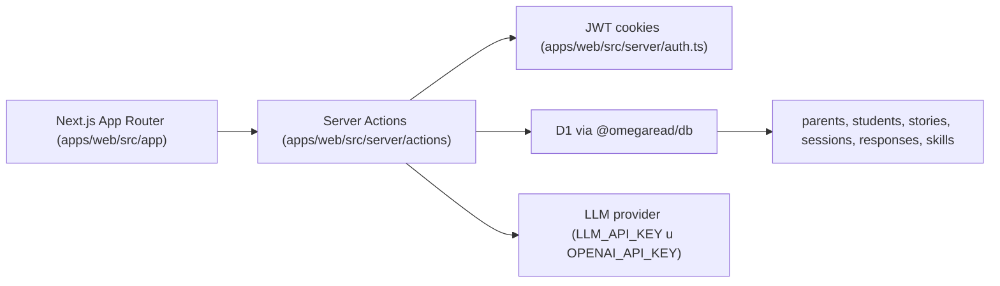

# OmegaRead

Lectura adaptativa para ninos con historias generadas por LLM, preguntas de comprension y dashboard para padres.

Estado de esta guia: 23 de febrero de 2026.

## Objetivo de este README

Este archivo esta escrito para que cualquier agente tecnico pueda entrar al repo y ser productivo rapido:

- entender arquitectura y flujos reales
- saber en que archivos tocar cada tipo de cambio
- ejecutar validaciones minimas antes de cerrar una tarea

Si vas a trabajar en el repo, lee tambien `AGENTS.md`.

## TL;DR tecnico

- Monorepo con `pnpm workspaces`
- App principal en `apps/web` (Next.js 15 + React 19 + App Router)
- Persistencia con `@omegaread/db` (Drizzle + Cloudflare D1, dialecto SQLite)
- Server Actions para toda la logica de negocio
- Generacion de historias/preguntas via proveedor compatible con OpenAI API
- CI con lint + typecheck + tests + knip
- Deploy a Cloudflare Workers usando OpenNext

## Arquitectura en 1 diagrama



## Estructura del repo

```text
omegaread/
  apps/
    web/
      src/app/                  # Rutas App Router y layouts
      src/components/           # UI de lectura, dashboard, perfil, charts
      src/contexts/             # Estado cliente compartido (student progress)
      src/server/               # Auth, DB helper, server actions, validaciones
      src/lib/                  # AI, scoring, learning graph, data catalogs
  packages/
    db/
      src/schema.ts             # Schema Drizzle (fuente de verdad de datos)
      drizzle/                  # SQL de migraciones para D1
  tests/                        # Vitest suites por sprint + cobertura transversal
  docs/                         # Arquitectura, specs, planning, research, reviews
```

## Mapa de rutas y flujo funcional

Rutas principales:

- `/` landing
- `/jugar` redirecciona a `/jugar/lectura`
- `/jugar/lectura` flujo principal del nino (intereses -> contexto -> lectura -> preguntas -> resultado)
- `/padre/registro`, `/padre/login`, `/padre/nuevo-hijo`, `/padre/dashboard`
- `/api/estudiantes` para resolver estudiante activo desde el cliente

Flujo de lectura (archivo orquestador: `apps/web/src/app/jugar/lectura/page.tsx`):

1. Resuelve estudiante activo (`StudentProgressContext`)
2. Evalua estado (`obtenerEstadoLectura`)
3. Si falta perfil: `SelectorIntereses` o `FormularioContexto`
4. Genera historia (`generarHistoria`) con trazas de progreso
5. Lee historia y captura metrica de lectura (incluye opcion de audio)
6. Genera/consume preguntas (`generarPreguntasSesion`)
7. Finaliza sesion (`finalizarSesionLectura`) y actualiza progreso

## Donde buscar segun tarea

| Tarea | Punto de entrada |
|---|---|
| Cambiar flujo de lectura | `apps/web/src/app/jugar/lectura/page.tsx` |
| Cambiar UX de lectura/preguntas/resultado | `apps/web/src/components/lectura/*` |
| Cambiar onboarding de perfil | `apps/web/src/components/perfil/*` y `apps/web/src/server/actions/profile-actions.ts` |
| Cambiar dashboard de padres | `apps/web/src/app/padre/dashboard/page.tsx`, `apps/web/src/components/dashboard/*`, `apps/web/src/server/actions/dashboard-actions.ts` |
| Cambiar autenticacion | `apps/web/src/server/auth.ts`, `apps/web/src/server/actions/auth-actions.ts` |
| Cambiar generacion LLM o prompts | `apps/web/src/lib/ai/*`, `apps/web/src/server/actions/story-actions.ts` |
| Cambiar reglas de aprendizaje/nivel | `apps/web/src/server/actions/reading-actions.ts`, `apps/web/src/lib/elo.ts`, `apps/web/src/lib/learning/graph.ts` |
| Cambiar modelo de datos | `packages/db/src/schema.ts` + `packages/db/drizzle/*` |
| Cambiar validaciones | `apps/web/src/server/validation.ts` |
| Cambiar deploy Cloudflare | `apps/web/wrangler.jsonc`, `apps/web/open-next.config.ts`, `.github/workflows/deploy.yml` |

## Setup local

Requisitos:

- Node.js >= 20
- pnpm >= 9

Instalacion:

```bash
pnpm install
```

Variables de entorno minimas para desarrollo:

```bash
AUTH_SECRET="<minimo-32-caracteres>"

# Opcion A: proveedor compatible con OpenAI API
LLM_API_KEY="<key>"
LLM_BASE_URL="https://..."
LLM_MODEL="glm-5"

# Opcion B: OpenAI directo (fallback)
OPENAI_API_KEY="<key>"

# Opcional en local
DEV_ADMIN_ENABLED="true"
```

Notas importantes:

- `AUTH_SECRET` es obligatorio y se usa para firmar JWT en cookies.
- La app prioriza `LLM_API_KEY`; si no existe, usa `OPENAI_API_KEY`.
- El runtime actual usa Cloudflare D1 binding (`DB`) via `getCloudflareContext`.
- `.env.example` aun menciona `DATABASE_URL` de PostgreSQL; hoy es referencia legacy y no refleja el runtime real de D1.

## Comandos utiles

| Comando | Uso |
|---|---|
| `pnpm dev` | Levantar app web en modo desarrollo |
| `pnpm build` | Build de produccion de la app web |
| `pnpm lint` | ESLint del repo |
| `pnpm typecheck` | Typecheck en workspace |
| `pnpm test` | Ejecutar Vitest |
| `pnpm test:watch` | Vitest en watch mode |
| `pnpm db:generate` | Generar artefactos Drizzle |
| `pnpm db:migrate` | Ejecutar migraciones Drizzle |
| `pnpm db:push` | Push de schema con Drizzle |
| `pnpm db:studio` | Abrir Drizzle Studio |

## Testing y calidad

Suites en `tests/`:

- cobertura transversal (`components`, `ownership`, `baseline-scoring`)
- suites por sprint (`sprint1`, `sprint2`, `sprint4`, `sprint5`)

CI (`.github/workflows/ci.yml`) ejecuta:

1. `pnpm lint`
2. `pnpm typecheck`
3. `pnpm test`
4. `pnpm knip:ci`

## Deploy

- Pipeline en `.github/workflows/deploy.yml`
- Trigger: push a `main`
- Build Cloudflare: `npx @opennextjs/cloudflare build`
- Deploy: `npx wrangler deploy`

Configuracion clave en `apps/web/wrangler.jsonc`:

- binding D1 `DB` (`omegaread-db`)
- vars runtime como `LLM_BASE_URL` y `LLM_MODEL`

## Fuente de verdad y docs con drift

Fuentes de verdad hoy:

- codigo runtime en `apps/web/src/*`
- schema y migraciones en `packages/db/*`
- pipeline CI/CD en `.github/workflows/*`

Documentos con posible drift respecto al codigo actual:

- `README-LIMPIEZA-REBOOT.md` (aun habla de rutas ya eliminadas)
- `PROMPT.md` (algunas instrucciones ya no coinciden con `apps/web/src/lib/ai/prompts.ts`)
- `.env.example` (todavia orientado a PostgreSQL)

## Licencia

- Codigo: [AGPL-3.0](LICENSE)
- Contenido educativo: CC-BY-SA 4.0
