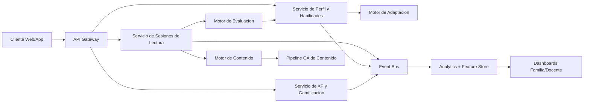
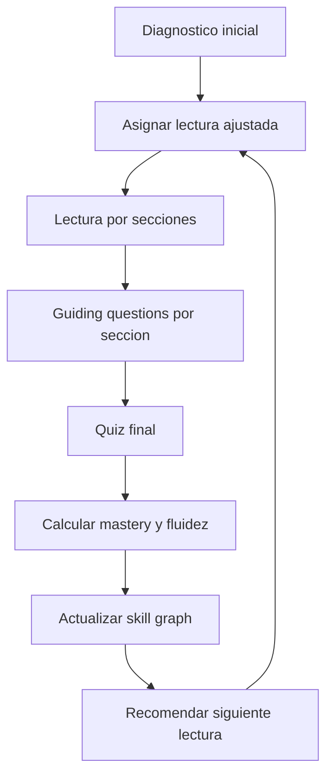

# SPEC de Producto: OmegaRead (equivalente abierto a AlphaRead)

Fecha: 2026-02-20  
Estado: Draft v1 (listo para discovery tecnico y roadmap)

## 1) Vision y tesis

Construir una plataforma de lectura personalizada para ninos que:

1. Adapte textos y preguntas al nivel real del nino.
2. Mantenga alta motivacion (intereses, narrativa, progreso visible).
3. Mejore dos resultados a la vez: comprension y fluidez (palabras por minuto con precision).
4. Sea abierta y accesible (coste bajo, despliegue flexible, extensible por escuelas y comunidades), con salida por fases.

Tesis central: no basta con "leer mas". Hay que optimizar el ciclo completo:
`texto correcto -> lectura activa -> comprension verificada -> feedback inmediato -> siguiente texto correcto`.

## 2) Lo que ya sabemos de AlphaRead/Alpha Anywhere (fuentes publicas)

Tomado de documentacion publica, no de acceso interno:

1. En AlphaRead suelen existir `4 guiding questions + 4 quiz questions` por articulo; mastery con `>=80%` total.
2. AlphaRead otorga XP por articulo con `>80%` de accuracy.
3. El progreso de AlphaRead en Dash se refleja "right away" (actualizacion inmediata).
4. Dash muestra accuracy, minutos por materia y anti-patterns.
5. Existe deteccion de anti-pattern "rushing questions": menos de 20s por pregunta y fuera de zona optima de accuracy.
6. Alpha Anywhere comunica diagnostico adaptativo (RIT), bracketing de nivel, sesiones de ~25 minutos y progreso en tiempo real.

Implicacion para nuestro producto: tu lista inicial es correcta, pero faltaban piezas clave de motor pedagogico:
diagnostico inicial, mastery formal, anti-gaming/anti-rush, recomendaciones de siguiente paso y calidad de contenido.

## 3) Problema que resolvemos

### Problema primario
Muchos ninos leen textos que no estan "en su zona de aprendizaje": demasiado faciles (aburrimiento) o demasiado dificiles (frustracion). Resultado: baja adherencia y crecimiento lento.

### Problemas secundarios
1. Padres y docentes no tienen visibilidad fina de habilidades (mas alla de nota final).
2. La velocidad de lectura mejora poco cuando no se mide con contexto de comprension.
3. Los sistemas cerrados limitan acceso, auditabilidad y mejora colectiva.

## 4) Usuarios y JTBD

### Usuario A: Nino (4-9)
JTBD: "Quiero leer historias que me gusten, entenderlas y sentir que progreso."

### Usuario B: Padre/Madre
JTBD: "Quiero saber si mi hijo realmente mejora en lectura y en que habilidades necesita ayuda."

### Usuario C: Docente/Guia
JTBD: "Quiero asignar lecturas adecuadas y detectar rapidamente quien esta atascado y por que."

## 5) Objetivos, no objetivos y metricas

### Objetivos de producto (12 meses)
1. Aumentar comprension promedio en quizzes en al menos +15 puntos.
2. Aumentar fluidez (WPM ajustado por comprension) en al menos +30%.
3. Mantener adherencia semanal (3+ sesiones/semana) por encima del 65%.
4. Mantener precision de dificultad (texto ni muy facil ni muy dificil) >80% segun feedback de desempeno.

### No objetivos (v1)
1. No reemplazar curriculum escolar completo.
2. No cubrir todas las materias, solo reading/language inicialmente.
3. No depender de tutoria humana sincrona para funcionamiento base.

### North Star
`CARF = Corrected Adaptive Reading Fluency = WPM * Comprension (%)`

Esto evita optimizar solo velocidad.

## 6) Requisitos funcionales (PRD)

### R1. Onboarding y perfil de aprendizaje
1. Alta de familia y perfil del nino.
2. Captura de intereses (temas), identidad narrativa (pronombres, contexto), personajes favoritos.
3. Baseline reading check:
   a) mini pasaje calibrado  
   b) quiz de comprension  
   c) estimacion inicial de WPM y accuracy de lectura
4. Colocacion inicial por nivel de lectura (no por edad unicamente).

### R2. Generacion/adaptacion de lecturas
Cada lectura se genera o selecciona con:
1. Dificultad objetivo (vocabulario, longitud de frase, densidad de ideas).
2. Tema de interes + objetivo curricular.
3. Restricciones de seguridad infantil y contenido apropiado por edad.
4. Modo ficcion/no ficcion.
5. Longitud adaptable (micro lectura 150-250 palabras, standard 300-600, extended 700+).

### R3. Estructura de sesion
1. Lectura dividida en secciones.
2. Pregunta de comprension por seccion (guiding).
3. Quiz final multi-item.
4. Feedback inmediato con explicacion breve.
5. Mastery por lectura con threshold configurable (default 80%).

### R4. Medicion de fluidez y comprension
1. Tiempo total de lectura por seccion y total.
2. WPM estimado por longitud real del texto.
3. Latencia de respuesta por pregunta.
4. Deteccion de "rushing": umbral minimo por pregunta + baja precision.
5. Score compuesto de lectura:
   `ReadingScore = 0.5*Comprension + 0.3*CARF normalizado + 0.2*Consistencia semanal`.
6. Fluidez oral para early readers:
   a) captura de audio de lectura en voz alta  
   b) ASR para estimar velocidad, errores y autocorrecciones  
   c) confidence score y fallback cuando ASR sea incierto

### R5. Gamificacion util (no adictiva)
1. XP por completar lecturas con calidad.
2. Bono por streak saludable (maximo semanal para evitar presion excesiva).
3. Badges por habilidades (inferencia, vocabulario, fluidez, etc).
4. Leaderboard opcional y privado por cohorte, desactivable por familia/escuela.

### R6. Dashboard de habilidades
Vistas:
1. Nino: progreso, streak, habilidades fuertes/debiles, siguiente mision.
2. Familia: tendencia WPM, comprension, tiempo efectivo, alertas de estancamiento.
3. Docente: matriz de habilidades por grupo, alumnos en riesgo, recomendaciones de intervencion.

### R7. Motor de recomendacion
Despues de cada sesion:
1. Ajustar dificultad.
2. Elegir siguiente lectura.
3. Ajustar tipo de pregunta (literal, inferencial, vocabulario en contexto, idea principal).
4. Priorizar skill gaps.

### R8. Seguridad, privacidad y compliance
1. Minimizacion de datos (solo lo necesario para aprendizaje).
2. Consentimiento parental verificable.
3. Borrado/export de datos.
4. Auditoria de prompts y contenidos servidos.
5. Alineacion con COPPA y FERPA desde diseno.
6. Gobernanza de audio infantil (captura, retencion, borrado y acceso).

## 7) Requisitos no funcionales

1. p95 carga de lectura < 2s.
2. p95 evaluacion de quiz < 800ms.
3. Uptime >= 99.5%.
4. Trazabilidad completa de decisiones de adaptacion.
5. Internacionalizacion (ES/EN en v1.1).
6. Accesibilidad: WCAG 2.1 AA.

## 8) Arquitectura de alto nivel

## 9) Flujo pedagogico (loop principal)

## 10) Modelo de datos minimo (v1)

Entidades:

1. `student_profile`
   Campos clave: edad, grado, idioma, intereses, preferencias narrativas, consent_version.
2. `reading_level_state`
   Campos clave: nivel actual, confianza de estimacion, fecha ultimo ajuste.
3. `reading_passage`
   Campos clave: texto, metadata dificultad, tema, origen, qa_score.
4. `question_item`
   Campos clave: tipo, skill_tag, distractores, respuesta correcta, explicacion.
5. `reading_session`
   Campos clave: inicio, fin, tiempo_total, wpm_estimado, accuracy_total, mastery.
6. `skill_signal`
   Campos clave: skill, prob_mastery, evidencia, timestamp.
7. `xp_event`
   Campos clave: puntos, razon, multiplicador, timestamp.

## 11) Calidad de contenido (punto critico)

Riesgo principal de este tipo de producto: contenido mediocre o con errores.

Pipeline obligatorio:
1. Generacion inicial de lectura y preguntas.
2. Evaluacion automatica por rubrica (nivel, coherencia, ambiguedad, sesgo, seguridad).
3. Reescritura automatica si falla umbrales.
4. Muestreo humano en contenidos de baja confianza.
5. Telemetria de calidad en produccion:
   a) tasa de preguntas ambiguas reportadas  
   b) tasa de respuestas correctas anormalmente altas sin lectura real  
   c) tasa de correcciones manuales

Umbral recomendado de lanzamiento:
`>=95%` de items por encima de score QA minimo.

## 12) Scope MVP (12 semanas)

### Fase 1 (Semanas 1-4): Fundacion
1. Onboarding + diagnostico inicial.
2. Motor de lecturas (plantillas + LLM + QA basico).
3. Sesion de lectura con quiz final.
4. Tracking de tiempo, accuracy, mastery.
5. Primer flujo de lectura en voz alta (TTS + ASR baseline).

### Fase 2 (Semanas 5-8): Adaptacion + motivacion
1. Ajuste automatico de dificultad.
2. XP, badges y streaks.
3. Dashboard familia.
4. Alertas de anti-pattern basicas.
5. Scoring de fluidez oral integrado en recomendaciones.

### Fase 3 (Semanas 9-12): Calidad + escuela
1. Skill graph por subhabilidades.
2. Dashboard docente.
3. QA hardening + auditoria de contenido y voz.
4. Piloto con 20-50 ninos.

## 13) Criterios de aceptacion de MVP

1. Un nino puede completar ciclo completo (leer, responder, recibir feedback) en <15 min.
2. Sistema ajusta dificultad en <=2 sesiones con base en desempeno real.
3. Dash familiar muestra tendencia semanal de CARF y comprension.
4. XP solo se concede con accuracy minima configurable (default 80%).
5. Deteccion de rushing activa con recomendaciones concretas.
6. Logs de contenido permiten auditar por que se mostro cada texto/pregunta.

## 14) Riesgos y mitigaciones

1. Riesgo: optimizar velocidad y destruir comprension.  
   Mitigacion: CARF como KPI primario, no WPM solo.

2. Riesgo: alucinaciones o mala calidad en preguntas.  
   Mitigacion: pipeline QA + muestreo humano + kill switch de item.

3. Riesgo: gamificacion que incentiva "farmear".  
   Mitigacion: XP ligado a mastery, decaimiento en repeticion, anti-rush.

4. Riesgo: carga para familias sin soporte docente.  
   Mitigacion: modo guiado con recomendaciones simples y reporte accionable.

5. Riesgo: privacidad infantil.  
   Mitigacion: data minimization, consentimiento parental, cifrado, retencion corta.

## 15) Estrategia open source y acceso

Decision actual:
1. Fase inicial en repositorio privado hasta alcanzar umbral de calidad y seguridad.
2. Definir licencia final en gate de apertura (AGPL vs Apache-2.0).
3. Abrir por fases:
   a) primero contratos, esquema de eventos y metricas  
   b) luego componentes core pedagogicos  
   c) por ultimo herramientas de contribucion comunitaria

Gate de apertura recomendado:
1. QA de contenido >=95%.
2. QA de voz/ASR estable en cohortes 4-6 y 7-9.
3. Baseline de privacidad infantil auditado.

## 16) Lo que anadimos respecto a tu lista inicial

Tu lista cubria bien el 60-70% del producto. El spec agrega piezas criticas para que funcione de verdad:

1. Diagnostico inicial adaptativo.
2. Mastery formal por umbral + skill graph.
3. Deteccion de anti-patterns (rushing, gaming, inconsistencia).
4. Motor de recomendacion y ajuste automatico de nivel.
5. QA robusto de contenido para evitar preguntas malas.
6. Compliance infantil y gobernanza de datos.

## 17) Snapshot de decisiones (2026-02-20)

1. Segmento inicial: `4-9 anos`.
2. Idioma inicial: `ES primero`.
3. Distribucion inicial: `B2C familias`.
4. MVP incluye lectura en voz alta y `ASR`.
5. Licencia final: pendiente, con fase privada inicial.

## 18) Fuentes consultadas (publicas)

1. Alpha School, "Working with AlphaRead"  
   https://support.alpha.school/article/30767-working-with-alpharead
2. Alpha School, "XP Guide"  
   https://support.alpha.school/article/129736-xp-guide
3. Alpha School, "When should I check my progress in Dash?"  
   https://support.alpha.school/article/31168-when-should-i-check-my-progress-in-dash
4. Alpha School, "How to Check Your Daily Learning Results in Dash"  
   https://support.alpha.school/article/31727-how-to-check-your-daily-learning-results-in-dash
5. Alpha School, "How to Evaluate Your Learning Progress"  
   https://support.alpha.school/article/31716-how-to-evaluate-your-learning-progress
6. Alpha School, "Understanding and Addressing Learning Anti-Patterns"  
   https://support.alpha.school/article/31771-understanding-and-addressing-learning-anti-patterns
7. Alpha Anywhere (sitio publico)  
   https://www.alphaanywhere.co/
