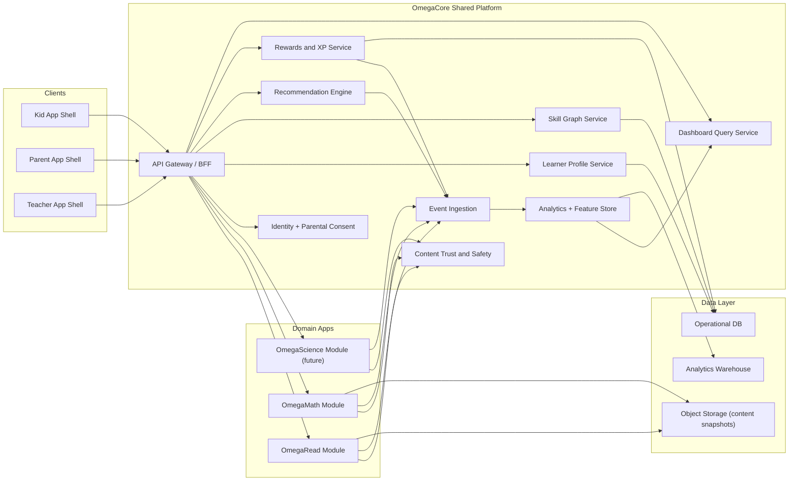
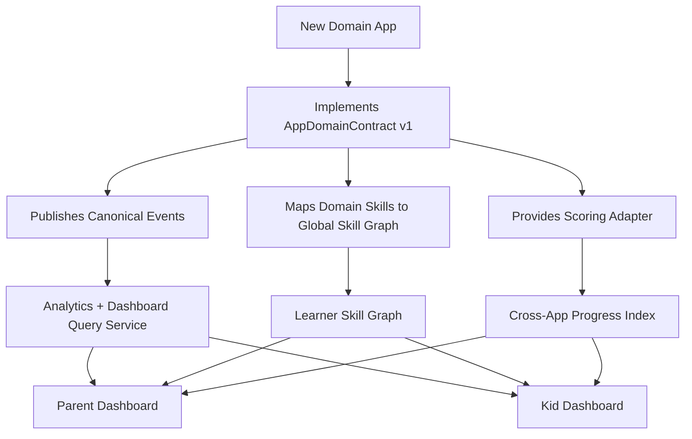

# Arquitectura OmegaAnywhere (Multi-App + Dashboard Reutilizable)

Fecha: 2026-02-20  
Estado: Draft v1

## Objetivo

Construir una arquitectura donde cada nueva app educativa (OmegaRead, OmegaMath, OmegaScience, etc.) reutilice:
1. Perfil del estudiante.
2. Skill graph comun.
3. Telemetria comun.
4. Dashboard padres/ninos reutilizable.
5. Motor de recomendaciones cross-app.

## Principio de diseno

Separar claramente:
1. `Core compartido` (identidad, datos, analytics, dashboard, rewards).
2. `Domain engines` por app (lectura, matematicas, ciencia).
3. `Contrato de integracion` para que una app nueva se conecte sin rehacer la plataforma.

## Diagrama de alto nivel

## Contrato obligatorio para nuevas apps (`AppDomainContract v1`)

Cada app nueva debe publicar:

1. `domain_id`  
   Ejemplo: `read`, `math`, `science`

2. `skill_map`  
   Mapea habilidades del dominio al skill graph comun.

3. `activity_schema`  
   Estructura de actividad/sesion para eventos.

4. `scoring_adapter`  
   Traduce resultado de dominio a metricas comparables.

5. `recommendation_signals`  
   Senales consumibles por el recommendation engine cross-app.

6. `dashboard_cards`  
   Definicion de tarjetas que se renderizan en dashboard padres/ninos.

## Diagrama de contrato de integracion

## Dashboard reutilizable (padres y ninos)

### Capa comun (reutilizable para todas las apps)

1. Perfil del nino y contexto de edad.
2. Tendencias semanales de progreso.
3. Alertas accionables.
4. Metas y rachas saludables.
5. Progreso por skill (no solo por app).

### Capa por dominio (plugin cards)

1. OmegaRead: CARF, mastery lectura, tiempo de lectura, anti-rush.
2. OmegaMath: accuracy por skill, latencia por ejercicio, consistencia.
3. OmegaScience: comprension conceptual y retencion.

## Modelo de metricas comparables cross-app

Definir una metrica normalizada por dominio:

`DomainProgressIndex = f(accuracy, fluency/latency, consistency, difficulty_gain)`

Regla:
1. Cada dominio calcula su score interno.
2. El `scoring_adapter` lo transforma a escala comun 0-100.
3. Dashboard familiar usa la escala comun para comparar progreso sin mezclar semantica.

## Esquema de eventos comun (minimo)

Eventos obligatorios:
1. `session_started`
2. `session_completed`
3. `question_answered`
4. `mastery_evaluated`
5. `recommendation_served`
6. `xp_awarded`
7. `anti_pattern_flagged`

Campos minimos:
1. `tenant_id`
2. `student_id`
3. `domain_id`
4. `session_id`
5. `timestamp`
6. `event_version`
7. `payload`

## Decisiones de arquitectura recomendadas

1. Monorepo con paquetes por dominio + paquetes core compartidos.
2. BFF/API gateway unico para controlar experiencia cross-app.
3. Feature store unificado para recomendaciones y dashboard.
4. Versionado fuerte de schemas (`event_version`, `contract_version`).
5. Trazabilidad de decisiones de contenido y recomendacion.

## Riesgos y mitigaciones

1. Riesgo: cada app define metricas incompatibles.
   Mitigacion: `scoring_adapter` obligatorio y pruebas de contrato.

2. Riesgo: dashboard termina siendo solo visual y no accionable.
   Mitigacion: alertas con recomendacion concreta y proximo paso.

3. Riesgo: acoplar demasiado dominio y core.
   Mitigacion: AppDomainContract estable + eventos canonicos.

4. Riesgo: deuda de datos por eventos inconsistentes.
   Mitigacion: validacion de schema en ingestion y rechazo de payload invalido.

## Checklist antes de sumar OmegaMath

1. AppDomainContract v1 congelado.
2. Skill graph lectura estable y reusable.
3. Dashboard padres/ninos con plugin cards probado.
4. Event schema comun desplegado y validado.
5. Scoring adapter de lectura operativo como referencia.

