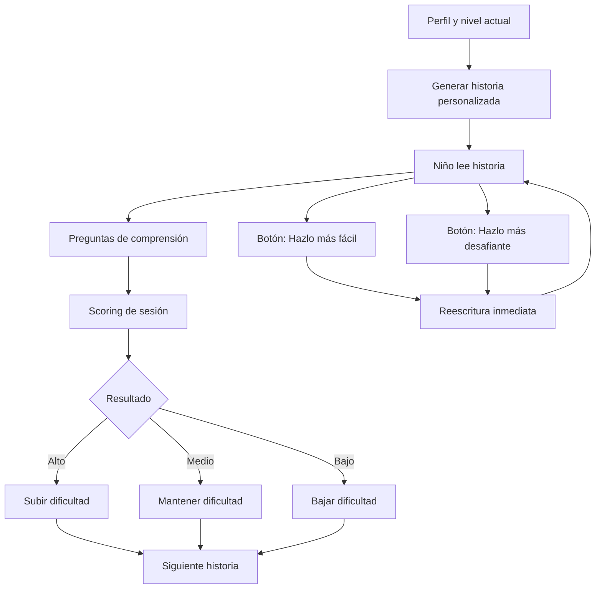

# SPEC OmegaRead Core Adaptativo

Versión: 2.0
Fecha: 2026-02-20
Estado: Activo

## 1) Tesis de producto

OmegaRead no es una app de fonética inicial para 4 años.
OmegaRead v1 es una app para niños 5+ que ya leen algo, pero:
- leen lento,
- o entienden poco lo que leen,
- o se desenganchan porque el contenido no les importa.

La propuesta de valor es:
- historias personalizadas por identidad e intereses,
- ajuste continuo de dificultad,
- mejora medible de comprensión.

## 2) Público objetivo

Primario:
- Niños de 5 a 9 años.
- Lectores emergentes o intermedios con brecha de comprensión.

Secundario:
- Madres/padres que quieren evidencia clara de progreso.

## 3) Datos de identidad y contexto

Campos mínimos:
- Perfil: edad, curso, idioma.
- Contexto: centro escolar, rutina de lectura, acompañamiento en casa.
- Intereses: temas, personajes favoritos, temas evitados.
- Señales de dificultad reportada: atención, vocabulario, frustración.

Regla:
- Sin perfil suficiente, no se habilita generación personalizada completa.

## 4) Flujo principal de sesión

## 5) Dificultad y adaptación

Variables de dificultad:
- Longitud total.
- Longitud media de oración.
- Complejidad léxica.
- Densidad de ideas nuevas.
- Tipo de pregunta posterior.

Señales de rendimiento:
- Comprensión (score de respuestas).
- Tiempo de lectura (inicio y fin).
- Tasa de acierto por tipo de pregunta.
- Uso de ajuste manual (`más fácil` / `más desafiante`).

Regla inicial de ajuste:
- Comprensión >= 80% y tiempo dentro de rango esperado: subir nivel.
- Comprensión 60-79%: mantener nivel.
- Comprensión < 60%: bajar nivel.

## 6) Preguntas de comprensión

Tipos obligatorios por sesión:
1. Literal (información explícita).
2. Inferencia (leer entre líneas).
3. Vocabulario en contexto.
4. Idea principal o mini resumen.

El scoring por tipo se guarda para diagnóstico de skill específico.

## 7) Reescritura en sesión

Controles visibles:
- `Hazlo más fácil`
- `Hazlo más desafiante`

Condiciones:
- Mantener topic e intención pedagógica.
- Ajustar solo complejidad, longitud y soporte contextual.
- Registrar evento de ajuste manual con motivo y resultado.

## 8) Modelo de progreso

Dos ejes de progreso:
- Skill global de lectura.
- Skill por topic (ej. ciencia, deportes, animales).

Métrica de sesión (v1):
- `session_score = 0.65 * comprensión + 0.25 * ritmo_normalizado + 0.10 * estabilidad`

Notas:
- `comprensión` domina el peso.
- `ritmo_normalizado` evita premiar solo velocidad bruta.
- `estabilidad` mide consistencia en sesiones recientes.

## 9) Dashboard niño (v1)

Principio:
- Gráficas simples y claras, no metáforas ambiguas.

Widgets mínimos:
- Tendencia de comprensión (7 sesiones).
- Ritmo lector (tiempo por lectura vs objetivo).
- Nivel actual y siguiente objetivo.
- Top 3 topics fuertes y 1 topic a reforzar.

## 10) Dashboard padre (v1)

Widgets mínimos:
- Evolución semanal de comprensión.
- Evolución de dificultad asignada.
- Comparativa por topics.
- Recomendaciones offline concretas.

## 11) Guardrails de calidad

- QA automático de seguridad y edad antes de publicar historia.
- Bloqueo de contenido inseguro o fuera de nivel.
- Trazabilidad de por qué se tomó cada decisión de dificultad.

## 12) Benchmark con AlphaRead

Objetivo:
- Adoptar lo que funcione en loop de aprendizaje y claridad de producto.

Checklist de benchmark:
- Calidad de onboarding de intereses.
- Claridad de adaptación de nivel.
- Usabilidad de preguntas de comprensión.
- Interpretabilidad del dashboard niño y padre.

## 13) Fuera de alcance v1

- Módulo centrado en vocales/sílabas como core.
- Matemáticas.
- ASR completo de fluidez oral en tiempo real.

## 14) Criterio de éxito del core

En 4-6 semanas de uso:
- mejora de comprensión medible por cohorte,
- mantenimiento de engagement en lectura,
- padres que entienden claramente progreso y siguiente paso.
