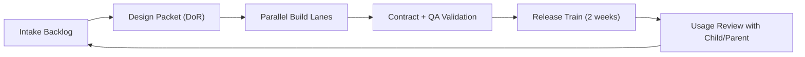

# Propuesta Completa de Arranque Continuo (no solo MVP)

Fecha: 2026-02-20  
Estado: propuesta para aprobacion

## Contexto cerrado

Fuente canonica de decisiones:
- `docs/planning/DECISIONES-CERRADAS.md`

## 1) Propuesta de stack (con opciones)

### Opcion A (recomendada): Hibrido TypeScript + Python

1. Frontend y dashboard:
   - `Next.js` + `TypeScript` + `Tailwind`
2. API/BFF de producto:
   - `Next.js route handlers` para endpoints de cliente y sesion
3. Servicios de IA/ASR:
   - `FastAPI` (Python) para scoring de lectura, heuristicas y pipelines de contenido
4. Datos:
   - `PostgreSQL` (modelo transaccional)
   - `Redis` (colas, cache y locks)
   - `S3-compatible object storage` para audio temporal y snapshots de contenido
5. Observabilidad:
   - `OpenTelemetry` + trazas por `session_id`
6. Monorepo:
   - `pnpm` workspaces (web, services, libs compartidas)

Por que es la mejor ahora:
1. TypeScript acelera UX/dashboard.
2. Python acelera ASR heuristico y evolucion a ML sin friccion.
3. Evita forzar audio/signal processing en stack no ideal.

### Opcion B: Todo TypeScript

Pros:
1. Un solo lenguaje.
2. Menos overhead de equipo al inicio.

Contras:
1. Peor ergonomia para evolucion de ASR/scoring avanzado.
2. Mayor friccion para pipelines de audio.

### Opcion C: Todo Python

Pros:
1. Excelente para IA/ML y pipelines.

Contras:
1. Menor velocidad para construir frontend/product shell moderno.
2. DX menos fluida para UI y app shell.

## 2) Propuesta Event Schema v1 y AppDomainContract v1

Definicion canonica (sin duplicar):
- `docs/architecture/OMEGAANYWHERE-ARQUITECTURA-MULTIAPP.md`

Reglas operativas de ejecucion:
1. Congelar `Event Schema v1` y `AppDomainContract v1` antes de build paralelo.
2. Ninguna app entra a produccion sin pasar pruebas de contrato.
3. Cualquier cambio breaking de contrato/evento requiere control de version explicito.

## 3) ASR V1 (ya acordado)

1. Se mantiene enfoque heuristico V1 ya definido en el spec.
2. No se entrena modelo propio en esta fase.
3. Se calibran umbrales con uso real de forma iterativa.

## 4) Politica de audio infantil (propuesta concreta)

Tu regla se traduce asi:

1. Consentimiento parental explicito antes de capturar audio.
2. Audio crudo se usa para scoring y se borra automaticamente.
3. Retencion por defecto de audio crudo: `<=15 minutos` tras scoring exitoso.
4. Si el job falla: cuarentena cifrada maxima `24h`, luego borrado forzoso.
5. Persistimos solo derivados no reconstruibles:
   - WPM oral
   - pausas
   - repeticiones
   - score de fluidez
   - confidence
6. Sin transcript completo persistente por defecto en menores.
7. Opcion de retencion extendida solo con opt-in explicito para debugging.

## 5) Propuesta de QA rubric de contenido

Escala por dimension: 1 a 5.  
Score final: promedio ponderado.

Dimensiones:
1. Ajuste de nivel lector (peso 25%).
2. Claridad de preguntas y no ambiguedad (20%).
3. Seguridad por edad y tono apropiado (20%).
4. Coherencia narrativa y calidad linguistica (15%).
5. Relevancia a intereses del nino (10%).
6. Sesgo/fairness (10%).

Reglas de pase:
1. Score ponderado minimo `>=4.2/5`.
2. Ninguna dimension critica (`nivel`, `seguridad`, `ambiguedad`) por debajo de `4.0/5`.
3. Si falla, se reescribe automaticamente y se reevalua.

Guardrails por edad:
1. `4-6 anos`: frases cortas, una idea central por parrafo, vocabulario de alta frecuencia.
2. `7-9 anos`: mayor longitud, inferencia moderada, vocabulario expandido controlado.

## 6) Propuesta DoR / DoD para trabajar con subagentes

### Definition of Ready (DoR)

Un item entra a implementacion solo si:
1. Tiene objetivo pedagogico y objetivo de producto claros.
2. Tiene acceptance criteria medibles.
3. Tiene eventos a emitir definidos.
4. Tiene impacto de privacidad clasificado (`none|low|high`).
5. Tiene plan de prueba (unit/integration/e2e o QA de contenido).
6. Tiene owner principal y owner de validacion.

### Definition of Done (DoD)

Un item se cierra solo si:
1. Cumple acceptance criteria.
2. Pasa pruebas de su capa.
3. Emite eventos esperados y trazables.
4. Tiene observabilidad minima (log + metric + alerta si aplica).
5. Tiene nota corta de impacto en aprendizaje/UX.
6. Si toca voz infantil: evidencia de borrado de audio en el flujo.

## 7) Propuesta de ejecucion continua multi-sprint (con subagentes)

No usar "un solo sprint MVP".  
Usar `flujo continuo` con olas superpuestas.

### 7.1 Modelo operativo

1. Cadencia semanal de decisiones (prioridades y bloqueos).
2. Release train cada 2 semanas (siempre potencialmente deployable).
3. 4 carriles en paralelo:
   - Carril A: discovery producto/pedagogia
   - Carril B: plataforma/core datos
   - Carril C: dominio OmegaRead (UX + contenido + ASR)
   - Carril D: calidad y validacion (tests + QA pedagogico)
4. Limite WIP:
   - maximo 2 epicas activas por carril
   - maximo 1 cambio de contrato (`event/contract`) por semana

### 7.2 Orquestacion por subagentes

Roles:
1. `product-manager`: define outcome y scope por ola.
2. `architecture-reviewer`: valida contratos y bordes.
3. `worker-build`: implementa paquetes por dominio.
4. `test-engineer`: valida funcional, datos y regresion.
5. `code-refactorer`: reduce deuda en hitos programados.

Regla:
1. Todo trabajo nace como `work packet` con AC, eventos y pruebas.
2. Ningun subagente mergea sin contrato y QA.

### 7.3 Flujo continuo (mermaid)

### 7.4 Propuesta de olas (8-12 semanas, sin rigidez de sprint unico)

Ola 1 (Semanas 1-2):
1. Contratos v1 (`event schema` + `AppDomainContract`).
2. Loop lectura base + quiz + mastery.

Ola 2 (Semanas 3-4):
1. ASR V1 heuristico operativo.
2. Politica de audio automatizada (analizar y borrar).

Ola 3 (Semanas 5-6):
1. Dashboard padres v1 accionable.
2. Alertas de anti-pattern y recomendaciones.

Ola 4 (Semanas 7-8):
1. Hardening de calidad de contenido y voz.
2. Medicion robusta de CARF y tendencia.

Ola 5 (Semanas 9-12):
1. Reuso de plataforma para bootstrap OmegaMath.
2. Dashboard multi-app con score comparable 0-100.

## Decision propuesta para arrancar ya

1. Aprobar Opcion A de stack (hibrido TypeScript + Python).
2. Congelar `Event Schema v1` y `AppDomainContract v1`.
3. Aplicar politica de audio: analizar y borrar.
4. Operar con flujo continuo por olas, no sprint unico.
